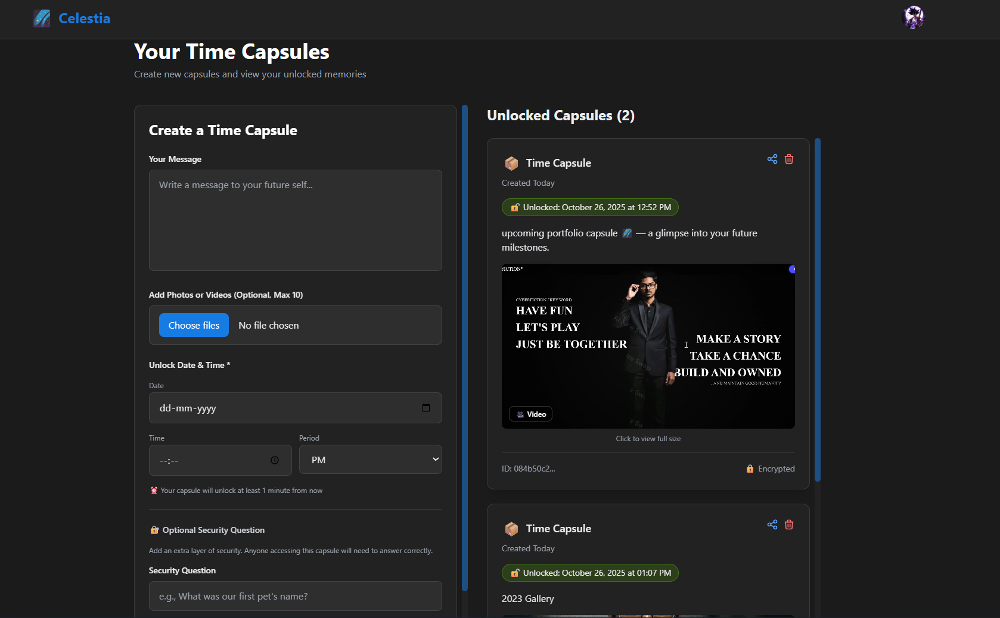
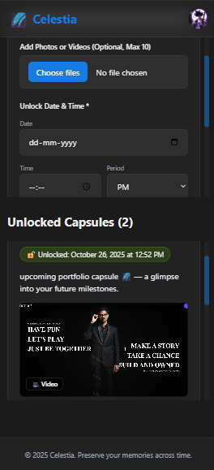
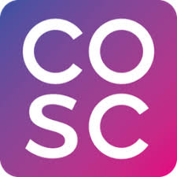

<h1 id="top">🌌 Celestia – Digital Time Capsule Web App</h1>


<div align="center">


**"Where memories meet the future ✨ — Unlock tomorrow, today."**

[](https://nextjs.org/)
[](https://www.typescriptlang.org/)
[](https://tailwindcss.com/)
[](https://clerk.com/)
[](https://neon.tech/)

[🚀 Live Demo](https://celestia-htf25.vercel.app/) • [🐛 Report Bug](https://github.com/Yaser-123/HTF25-Team-385/issues) • [✨ Request Feature](https://github.com/Yaser-123/HTF25-Team-385/issues)

</div>

---

## 📖 About The Project

**Celestia** is a modern, secure, and beautiful digital time capsule application that lets you preserve memories, messages, photos, and videos to be unlocked at a future date. Built for **CBIT HacktoberFest '25**, Celestia combines cutting-edge web technologies with thoughtful UX design to create a unique experience for preserving and sharing moments across time.

### ✨ Key Highlights

- 🔐 **End-to-End Encryption** - Your memories are secured with AES-256 encryption
- 🎨 **Beautiful UI** - Modern, responsive design with smooth animations
- 📱 **PWA Ready** - Install on any device, works offline
- 🖼️ **Multi-Media Support** - Store multiple photos and videos in each capsule
- ⏰ **Auto-Unlock** - Capsules unlock automatically when the time comes
- 🎭 **Stunning Animations** - Engaging unlock animations and transitions
- 🔗 **Shareable Links** - Share your capsules with friends and family

---

## 🎯 Features

### 🔒 Create Time Capsules


- **Rich Content Editor** - Write messages with markdown support
- **Multi-Media Upload** - Add up to 10 photos/videos per capsule
- **Custom Unlock Dates** - Set any future date for your capsule
- **Privacy Controls** - Keep capsules private or share via link

### 🎬 Immersive Media Experience


- **Full-Screen Carousel** - Browse media with smooth transitions
- **Keyboard & Swipe Navigation** - Arrow keys and touch gestures
- **Video Support** - Play videos directly in the carousel
- **Thumbnail Grid** - Quick navigation with visual previews

### 📱 Responsive Design



- **Mobile-First** - Optimized for all screen sizes
- **Touch-Friendly** - Smooth gestures and interactions
- **PWA Support** - Install on home screen, works offline

---

## 🛠️ Tech Stack

### Frontend
- **[Next.js 15](https://nextjs.org/)** - React framework with App Router
- **[TypeScript](https://www.typescriptlang.org/)** - Type-safe JavaScript
- **[Tailwind CSS](https://tailwindcss.com/)** - Utility-first styling
- **[Framer Motion](https://www.framer.com/motion/)** - Smooth animations

### Backend & Database
- **[Neon PostgreSQL](https://neon.tech/)** - Serverless Postgres database
- **[Drizzle ORM](https://orm.drizzle.team/)** - Type-safe database toolkit
- **[Clerk](https://clerk.com/)** - Authentication & user management

### Security & PWA
- **AES-256 Encryption** - Client-side content encryption
- **[next-pwa](https://github.com/shadowwalker/next-pwa)** - Progressive Web App support
- **Service Workers** - Offline functionality

---

## 🚀 Getting Started

### Prerequisites
- Node.js 18+ and npm
- Neon PostgreSQL account ([Sign up free](https://neon.tech/))
- Clerk account ([Sign up free](https://clerk.com/))

### Installation

1. **Clone the repository**
```bash
git clone https://github.com/Yaser-123/HTF25-Team-385.git
cd HTF25-Team-385
```

2. **Install dependencies**
```bash
npm install
```

3. **Set up environment variables**

Create a `.env.local` file in the root directory:

```bash
# Clerk Authentication Keys
NEXT_PUBLIC_CLERK_PUBLISHABLE_KEY=your_clerk_publishable_key
CLERK_SECRET_KEY=your_clerk_secret_key

# Neon Database Connection String
DATABASE_URL=your_neon_database_url

# Encryption Secret Key (32 bytes for AES-256)
ENCRYPTION_KEY=your_32_character_secret_key
```

4. **Push database schema**
```bash
npm run db:push
```

5. **Run the development server**
```bash
npm run dev
```

6. **Open [http://localhost:3000](http://localhost:3000)** in your browser 🎉

---

## 📦 Build & Deploy

### Build for Production
```bash
npm run build
npm start
```

### Deploy to Vercel
[](https://vercel.com/new/clone?repository-url=https://github.com/Yaser-123/HTF25-Team-385)

1. Click the button above or connect your GitHub repo
2. Add environment variables in Vercel dashboard
3. Deploy! 🚀

---

## 🗂️ Project Structure

```
HTF25-Team-385/
├── app/                    # Next.js app directory
│   ├── api/               # API routes
│   ├── capsule/[id]/      # Dynamic capsule pages
│   ├── sign-in/           # Authentication pages
│   └── globals.css        # Global styles
├── components/            # React components
│   ├── CapsuleCard.tsx    # Capsule preview cards
│   ├── CapsuleForm.tsx    # Create capsule form
│   ├── MediaCarousel.tsx  # Full-screen media viewer
│   └── UnlockAnimation.tsx # Unlock effect
├── lib/                   # Utility functions
│   ├── db/                # Database schema & config
│   └── encryption.ts      # AES-256 encryption
├── public/                # Static assets
│   ├── manifest.json      # PWA manifest
│   └── sw.js             # Service worker
└── assets/               # Documentation assets
```

---

## 🎨 Color Palette

Celestia uses a carefully crafted blue/green theme:

- **Background**: `#1B1B1B` - Deep space black
- **Primary**: `#177BE4` - Celestial blue
- **Success**: `#56AD01` - Future green
- **Text**: `#9A999C` - Soft gray
- **Borders**: `#9A999C` - Subtle dividers

---

## 🤝 Contributing

<div align="center">

### Built with ❤️ by CSOC Community



**CBIT Open Source Community**

We're a passionate community of developers, designers, and tech enthusiasts at CBIT, dedicated to building open-source projects and fostering a culture of collaboration and learning.

[Join CSOC](https://csoc.cbit.org.in/) • [GitHub](https://github.com/CSOC-CBIT)

</div>

---

Contributions are what make the open-source community such an amazing place to learn, inspire, and create. Any contributions you make are **greatly appreciated**! 🌟

### How to Contribute

1. **Fork the Project**
2. **Create your Feature Branch**
   ```bash
   git checkout -b feature/AmazingFeature
   ```
3. **Commit your Changes**
   ```bash
   git commit -m 'Add some AmazingFeature'
   ```
4. **Push to the Branch**
   ```bash
   git push origin feature/AmazingFeature
   ```
5. **Open a Pull Request**

### Contribution Guidelines

- ✅ Follow the existing code style
- ✅ Write meaningful commit messages
- ✅ Test your changes thoroughly
- ✅ Update documentation if needed
- ✅ Be respectful and constructive

---

## 👨‍💻 Developer

<div align="center">


### **T Mohamed Yaser**
*Solo Developer - Team #385*

[](https://github.com/Yaser-123)
[](https://linkedin.com/in/mohamedyaser08/)
[](mailto:1ammar.yaser@gmail.com)

*"Building the future, one commit at a time."* 🚀

</div>

---

## 🏆 Hackathon

<div align="center">

### CBIT HacktoberFest '25

**Team #385** | Solo Project

This project was built as part of **CBIT HacktoberFest 2025**, a celebration of open-source development and innovation at Chaitanya Bharathi Institute of Technology.

</div>

---

## 📄 License

This project is open source and available under the [MIT License](LICENSE).

---

## 🙏 Acknowledgments

- **[CSOC](https://csoc.cbit.org.in/)** - For fostering the open-source community at CBIT
- **[CBIT](https://www.cbit.ac.in/)** - Chaitanya Bharathi Institute of Technology
- **[Vercel](https://vercel.com/)** - For amazing deployment platform
- **[Neon](https://neon.tech/)** - For serverless PostgreSQL
- **[Clerk](https://clerk.com/)** - For seamless authentication

---

<div align="center">

### ⭐ Star this repo if you find it helpful!

**Made with 💙 and ☕ by [Yaser](https://github.com/Yaser-123)**

*Celestia - Where memories meet the future* 🌌

[↑ Back to Top](#top)

</div>
